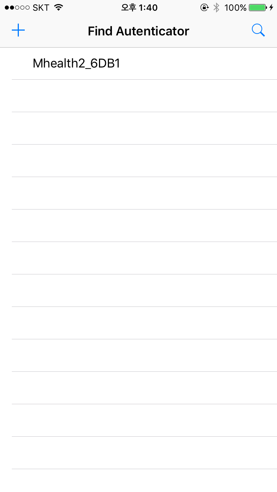

* CoreBluetooth 프로젝트를 진행한 경험을 포스팅한다.
* [Core Bluetooth Programming Guide](https://developer.apple.com/library/content/documentation/NetworkingInternetWeb/Conceptual/CoreBluetooth_concepts/AboutCoreBluetooth/Introduction.html)

## Central과 Periphral

 최근 Fido 생체 인증 개발을 진행하면서 생체 인증 기기를 어플리케이션에 연동하는 작업을 진행하게 되면서 격은 경험을 포스팅 하려고 합니다. iOS에서 CoreBluetooth 프레임워크를 사용하면서 격게되는 여러가지 트러블 슈팅과 관련해서 적어 내려가려 하는데, 이 글이 누군가에게 도움이 되었으면 좋겠습니다.

 iOS 개발에서 사수 없이 혼자 [apple 프로그래밍 가이드](https://developer.apple.com/library/content/documentation/NetworkingInternetWeb/Conceptual/CoreBluetooth_concepts/AboutCoreBluetooth/Introduction.html)를 읽고 개발을 진행하면서 영어로된 문서지만 많이 어려운 내용이 아니라 어느정도 읽고 개발에 들어가면 큰 도움이 될거 같습니다.

 아래의 내용은 제가 하나도 모르는 상태에서 개발자 가이드와 여러 가이드 문서를 읽으며 학습한 내용을 그대로 적은것 입니다. 만약, 이것을 읽고 내용을 다 흡수한다면 저보다는 CoreBluretooth 프레임워크를 잘 이해하고 있다고 자신 하셔도 됩니다.

 먼저, iOS의 corebluetooth 프레임워크를 사용할 때 정확하게 잡고 가야 하는 개념으로는 Central과 Peirpheral의 역할를 이해해야 합니다. 데이터를 받아오고 처리하는 기기가 Cental의 역할을 맡게되고 데이터를 측정하고 Central로 데이터를 전송하는 기기를 Peripheral 이라 합니다.

 저의 경우에는 사용자의 정보를 측정해 이 사용자를 구분하는 인증기(Authenticator)를 Peirpheral로 보고, 인증기가 가져온 데이터를 가공 사용자에게 제공하거나 서버로 올리는 iPhone을 Central이라 볼 수 있습니다. 이 역할은 항상 상대적인 것으로 iPhone이 Peirpheral의 역할을 수행하고 다른 장비가 Central의 역할을 수행 할 수 도 있습니다.

 다행이 그 어떤 역할을 수행하게 되더라도 iOS의 CoreBlutooth 프레임워크는 복잡한 역할을 간단하게 수행할 수 있도록 추상화를 제공합니다. 그 중 저는 Central의 역할을 수행하기 위해서 CentralManager를 생성하고 관리할 필요가 있습니다.

---

## CentralManager




**위 화면에 들어갈 기능은 다음과 같습니다.**

---

1. 주변 장치 검색
2. 과거 연결 장치 자동 연결
3. 장치 검색시 특정 서비스를 제공하는 장치만 선별 검색
4. 검색 장치를 table에 보여주기
5. 선택시 해당 장치 연결


#### 1. CBCentalManager 생성

 tableViewController(BluetoothTableViewController)를 만들고 CoreBluetooth 프레임워크를 추가합니다.

```swift
BluetoothTableViewController.h
#import <CoreBluetooth/CoreBluetooth.h>
```

 iOS 기기가 Central 역할을 수행할 수 있도록 관리해줄 CentralManager 객체를 정의합니다.

```swift
BluetoothTableViewController.h
@property (strong, nonatomic) CBCentralManager *centralManager;
```

  추가적으로 `ViewController`가 `CentralManager`의 이벤트를 수행할 수 있도록 `CBCentralManagerDelegate`를 구현해야 합니다.

```swift
BluetoothTableViewController.h
@interface BluetoothTableViewController : UITableViewController<UITableViewDelegate,CBCentralManagerDelegate>
```

 `BluetoothTableViewController.m` 파일로`_centralManager`를 생성하고 이벤트를 처리할 `delegate`로 `BluetoothTableViewController`를 지정합니다. 이제 `centralManger` 를 통해서 블루투스 기능을 사용하고 관리할 수 있게 되었습니다.

```swift
BluetoothTableViewController.m
- (void)viewDidLoad {
    [super viewDidLoad];
    _centralManager = [[CBCentralManager alloc] initWithDelegate:self queue:nil];
}
```


#### 2. Bluetooth 상태 확인하기

CentralManager를 통해서 디바이스의 블루투스 상태를 확인 할 수 있습니다. 기존의 로직 처리는 아래와 같이 상태가 변경될 때 마다 호출되는 메소드에서 상태값을 체크하는 방식으로 구현했습니다.

```swift
- (void)centralManagerDidUpdateState:(nonnull CBCentralManager *)central {
    switch (central.state) {
        case CBManagerStateUnknown:
            break;
        case CBManagerStateResetting:
            break;
        case CBManagerStateUnsupported:
            break;
        case CBManagerStateUnauthorized:
            break;
        case CBManagerStatePoweredOff:
            break;
        case CBManagerStatePoweredOn:
            break;
    }
}
```

 `CentralManager`가 생성될 때 한번 호출되고 나중에 상태가 변경될 때 마다 호출되기 때문에 필요한 로직을 추가 할 수 있습니다. 우리가 주변 장치를 찾을 수 있는 유일한 상태는 `CBManagerStatePoweredOn` 뿐입니다.

 **다만, 이런 처리 로직은 더 이상 권장하지 않습니다.**

 이제는 블루투스 기능이 꺼져있다면 app을 키면 iOS에서 설정으로 이동할 수 있는 얼럿 박스가 자동으로 표시되기 때문에 이제는 메세지를 무시하고 그냥 스캔하려고 했을 경우에만 처리하는 로직을 넣어주면 됩니다.

```swift
-(void)startSearch:(id)sender {
    if (_centralManager.state == CBManagerStatePoweredOn){
            NSLog(@"Start Search");
            [_peripheralList removeAllObjects];
            [self.tableView reloadData];
            [_centralManager scanForPeripheralsWithServices:@[[CBUUID UUIDWithString:@"0xFF00"]] options:nil];
            UIBarButtonItem *stop = [[UIBarButtonItem alloc] initWithBarButtonSystemItem:UIBarButtonSystemItemStop target:self action:@selector(stopSearch:)];
            self.navigationItem.rightBarButtonItem = stop;
            [[UIApplication sharedApplication] setNetworkActivityIndicatorVisible:YES];
    } else {
        [self ShowBluetoothSettingAlert];
    }
}

-(void)ShowBluetoothSettingAlert {
    UIAlertAction *cancel = [UIAlertAction actionWithTitle:@"cancel" style:UIAlertActionStyleDestructive handler:^(UIAlertAction * _Nonnull action) {
    }];
    UIAlertAction *goOption = [UIAlertAction actionWithTitle:@"setting" style:UIAlertActionStyleDefault handler:^(UIAlertAction * _Nonnull action) {
        [[UIApplication sharedApplication] openURL:[NSURL URLWithString:@"App-Prefs:root=Bluetooth"] options:@{} completionHandler:nil];
    }];
    [OpenitUtils showAlertBox:self Title:@"Openit Fido" Message:@"Plz check your Device's Bluetooth setting" Actions:@[cancel,goOption]];
}
```

블루투스 설정을 열기 위해서`[[UIApplication sharedApplication] openURL:[NSURL URLWithString:@"App-Prefs:root=Bluetooth"] options:@{} completionHandler:nil];` 메소드를 사용했습니다. 다른 설정을 여는 것도 가능하니 기억하고 있다가 필요할 때 검색을 해봅시다.

#### 3. 주변 기기 스캔

이 centralManager를 통해서 주변 장치를 Scan해 블루투스 4.0을 지원하는 장비들을 찾을 수 있습니다. 스캔을 할 때에는 파라미터로 서비스를 지정해 주는걸 권장하고 있습니다. 계속해서 무작위 전체 기기를 검색하는 것은 리소스를 많이 소모하게 됩니다.

```swift
// 이때 Service에 특정 서비스의 UUID를 통해 그 서비스를 지원하는 장치만 찾을 수 있다.
[_centralManager scanForPeripheralsWithServices:@[[CBUUID UUIDWithString:@"0xFF00"]] options:nil];
// 혹은 이미 특정 기기의 UUID를 알고 있다면 이 방법으로 특정 기기 정보만을 스캔할 수 있다.
NSUUID *uuid = [[NSUUID alloc] initWithUUIDString:uuidString];
NSArray* periphralarray = [_centralManager retrievePeripheralsWithIdentifiers:@[uuid]];
```

scan에서 줄 수 있는 옵션은 아래와 같습니다.

* [`CBCentralManagerScanOptionAllowDuplicatesKey`](apple-reference-documentation://hcCbC3oG6V)
* [`CBCentralManagerScanOptionSolicitedServiceUUIDsKey`](apple-reference-documentation://hcAaTnSNz7)

Scanning 중 장치를 발견할 때 마다 delegate의 `didDiscoverPeripheral` 메소드가 호출되는데 우리는 발견한 장치들을 table에 보여줄 것이기 때문에 그에 따른 처리가 필요합니다. (TableView를 다루는 방법은 생략합니다. 여기까지 오셨으면 다들 하실 수 있을거라 믿습니다.)

```swift
- (void)centralManager:(CBCentralManager *)central didDiscoverPeripheral:(CBPeripheral *)peripheral advertisementData:(NSDictionary<NSString *,id> *)advertisementData RSSI:(NSNumber *)RSSI {
	//발견한 장치를 logging
    NSLog(@"Discovered %@ at %@", peripheral.name, RSSI);

    //내 프로젝트에서는 특정 장비만 지원하는 Fido asm의 역할을 수행하기 때문에 필터링을 한다.
    NSString *name = [peripheral.name stringByTrimmingCharactersInSet:[NSCharacterSet whitespaceCharacterSet]];

    if ([name hasPrefix:@"Mhealth2"]) {
        CBPeripheral *discovered = [peripheral copy];
        [_peripheralList addObject:discovered];
        [self.tableView reloadData];
    }
}
```


#### 4. 선택 기기 연결

 tableView에 표시된 기기 중 선택 기기를 연결하려고 한다. `didSelectRowAtIndexPath` 에 로직을 추가하자.

 제 경우 비지니스 모델이 인증기 회사와 협업하여 특정 기기에 타겟팅되어 개발했습니다. 그 기기 전용으로 앱을 만들었기 때문에 이름으로 필터링을 했습니다. 그럼에도 혹시 같은 장소에 여러 동일한 기기가 있을 경우를 생각해 선택해서 연결하는 방식을 취했습니다.

```swift
-(void)tableView:(UITableView *)tableView didSelectRowAtIndexPath:(NSIndexPath *)indexPath {
    CBPeripheral *selectedPeripheral = (CBPeripheral*)_peripheralList[indexPath.row];
    NSLog(@"try connect :%@",selectedPeripheral.name);
    _discoveredPeripheral = selectedPeripheral;
    [self connetSelectedPeriphral];
}
-(void)connetSelectedPeriphral {
    [_prograss setLabelText:@"Openit FIDO"];
    [_prograss setDetailsLabelText:@"connecting with device"];
    [_prograss showUsingAnimation:YES];
    [_centralManager connectPeripheral:_discoveredPeripheral options:@{CBConnectPeripheralOptionNotifyOnConnectionKey:@YES}];
}
```

 이 커넥션은 조금 특이한데 한번 기기와 커넥션을 시도하면 타임아웃 없이 연결될 때 까지 계속 신호를 전송하게 됩니다. 현재 테스트 하는 기기의 경우 연결까지 20초 정도 시간이 소요되었는데, 연결이 너무 지연되었을 경우데 따른 로직도 추가 할 수 있습니다. 만약, 너무 지연될 경우 연결 신호를 계속 전송하는 자원을 낭비하기 때문에 수동으로 중지 가능하다.

```swift
// 이 메소드의 경우
[_centralManager cancelPeripheralConnection:_discoveredPeripheral];
```

 연결이 완료되면 CentralManager의 delegate에서 `didConnectPeripheral:` 메소드가 호출되고 이후 기기의 정보를 받아오거나 수정 할 수 있게 됩니다.

```swift
-(void)centralManager:(CBCentralManager *)central didFailToConnectPeripheral:(CBPeripheral *)peripheral error:(NSError *)error {
    if(error) {
        NSLog(@"%@", error.debugDescription);
    }
    _discoveredPeripheral = peripheral;
    [self connetSelectedPeriphral];
}
```

 기기가 연결에 성공하면 측정을 위해서 다음 화면으로 넘어가도록 구현 했습니다.

## Peripheral

기기 연결 후 측정을 위한 화면으로 넘어왔는데(CheckViewController), 여기서 구현해야 하는 다음과 같습니다.

* 연결된 장치의 서비스와 특성 읽어오기
* 응답을 받기를 원하는 특성을 구독하기
* 측정을 위해서 기기에 측정 요청 정보 보내기
* 기기가 보내는 측정 정보 받기

#### 1. CBPeripheralDelegate 설정

Central과 마찬가지로 Peripheral과 관련된 다양한 이벤트들을 처리하기 위해서는 delegate protocol을 준수해야합니다.

```swift
CheckViewController.h
@interface CheckViewController : UIViewController<CBPeripheralDelegate>

CheckViewController.m
- (void)viewDidLoad {
    [super viewDidLoad];
    // Do any additional setup after loading the view.
    _selectedPeripheral.delegate = self;
}
```

#### 2. 서비스 정보 요청

_selectedPeripheral은 이전의 controller에서 넘겨받아온 기기 정보로 현재는 이렇다할 정보를 담고 있지 않습니다.

```swift
//이때 서비스의 UUID를 이미 알고있다면 특정 서비스 정보만 호출 가능하다.
[_selectedPeripheral discoverServices:nil];
```

#### 3. 서비스 요청

```swift
// 이때 특정 서비스의 UUID를 이미 알고 있다면 그 서비스의 정보만 확인 가능하다.
[_selectedPeripheral discoverServices:@[ [CBUUID UUIDWithString:WSB_SERVICE_UUID]]];
```

서비스 정보를 받게되면 `didDiscoverServices`가 호출됩니다.

```swift
-(void)peripheral:(CBPeripheral *)peripheral didDiscoverServices:(NSError *)error {
    if (error != nil) {
        NSLog(@"discoverServices error : peripheral: %@, error: %@",peripheral.name,error.debugDescription);
    } else {
        _selectedPeripheral = peripheral;
        for (CBService *service in peripheral.services) {
            NSLog(@"discoverd service : %@",service.debugDescription);
            if([service.UUID.UUIDString isEqualToString:@"FF00"]) {
                [peripheral discoverCharacteristics:nil forService:service];
            }
        }
    }
}
```

여기서 우리는 FF00에 해당하는 서비스가 제공하는 특성 정보만을 원하기 때문에 필터링을 거친 후 서비스에 대한 특성 정보를 요청한다.

```swift
[peripheral discoverCharacteristics:nil forService:service];
```

이때 특성의 UUID를 알고 있다면 그 특성만 요청 할 수 있지만 제 경우에는 모든 특성이 필요하기 때문에 nil로 설정했습니다.

#### 4. 특성 구독

특성이 발견되면 `didDiscoverCharacteristicsForService`메소드가 호출된다. 이 메소드에서 특성들을 구독할 수 있습니다.

```swift
-(void)peripheral:(CBPeripheral *)peripheral didDiscoverCharacteristicsForService:(CBService *)service error:(NSError *)error {
    for (CBCharacteristic *charater in service.characteristics) {
        NSLog(@"discovered Characteristic :%@",charater.debugDescription);
        _selectedPeripheral = peripheral;
        _selectedPeripheral.delegate = self;
        [_selectedPeripheral setNotifyValue:YES forCharacteristic:charater];
    }
}
```

 현재 이 서비스에서는 2가지 특성을 제공하는데 하나는 측정 정보를 기기가 전송해주는 특성이고 다른 하나는 우리가 데이터를 보내는 데이터를 받기 위한 특성입니다. 기기에 대한 정보가 없어서 많이 처음에 많이 고생했는데, 두 특성 중 하나는 구독이 안되서 구독이 안되는 특성을 데이터를 받기 위해 존재하는 특성 추측하고 개발했습니다.

이 메소드는 2개의 특성을 발견하기 때문에 2번 호출되는데, 어차피 데이터를 보내는 용도로만 사용하는 특성은 구독을 해도 상태값이 변경되지 않도록 막혀 있기 때문에 필터링을 거치지 않았습니다.

```swift
[_selectedPeripheral setNotifyValue:YES forCharacteristic:charater];
```

이 메소드를 통해서 특성을 구독할 수 있습니다. 기기가 가진 특성의 noti값을 true로 변경을 요청하면 값이 변경된다면 데이터가 변경되면 자동으로 Central 쪽으로 데이터를 전송합니다.

이 때 noti를 변경하려고 하면 호출되는 메소드가 있는데 여기서 셋팅이 잘 되었는지 확인 할 수 있습니다. 제 경우는 여기서 노티 셋팅이 바뀌지 않는 특성을 저장하는 필터링을 거치도록 했습니다.

```swift
-(void)peripheral:(CBPeripheral *)peripheral didUpdateNotificationStateForCharacteristic:(CBCharacteristic *)characteristic error:(NSError *)error {
    if (characteristic.isNotifying) {
        //정보를 받아오는 케릭터
        NSLog(@"Notification began on %@", characteristic);
        _stateLabel.text = @"Notification began";
    } else {
        //정보를 던져야 하는 캐릭터
        NSLog(@"Notification finish on %@", characteristic);
        _characteristic = characteristic;
    };
}
```


#### 5. 측정 요청 (데이터 보내기)

```swift
- (IBAction)measure:(UIButton *)sender {
    NSData *request = [WSB onRegisterData];
    if (request != nil){
        [_selectedPeripheral writeValue:request forCharacteristic:_characteristic type:CBCharacteristicWriteWithoutResponse ];
        [self showLoadingView];
    }
}
```

버튼을 누르면 데이터를 보내도록 구현했습니다.  `NSData *request = [WSB onRegisterData];` 부분은 신경쓰지 않으셔도 됩니다. 전달 해 줘야 하는 데이터는 기기에 따라 다르니까 개발마다 변경됩니다.

 이 때 데이터를 보내는데 사용하는 메소드를 살펴보면.

```swift
[_selectedPeripheral writeValue:request forCharacteristic:_characteristic type:CBCharacteristicWriteWithoutResponse ];
```

여기서 제공하는 type 값에는 요청 후 바로 반환값을 받도록 대기하는 `CBCharacteristicWriteWithResponse`옵션과 리스폰을 받지 않는 `CBCharacteristicWriteWithoutResponse`옵션이 존재합니다.

 측정을 요청하면 측정 데이터를 돌려주니 당연히 `CBCharacteristicWriteWithResponse`라고 생각하고 계속 시도했지만 실패했습니다. 알고보니 요청 후 나중에 측정이 완료되면 데이터를 반환하기 때문에 `CBCharacteristicWriteWithoutResponse`로 설정하고 데이터를 보냈어야 했습니다.

#### 6. 데이터 받기

```swift
-(void)peripheral:(CBPeripheral *)peripheral didUpdateValueForCharacteristic:(CBCharacteristic *)characteristic error:(NSError *)error {
    NSString *result = [WSB dataParser:characteristic];
    if(result != nil) {
        [self stopLoadingView];
        NSLog(@"result:%@",result);

        if([result isEqualToString:@"SUCCESS"]) {
            UIAlertAction *okAction = [UIAlertAction actionWithTitle:@"Done" style:UIAlertActionStyleDefault handler:^(UIAlertAction * _Nonnull action) {
            }];
            [OpenitUtils showAlertBox:self Title:@"Openit FIDO" Message:result Actions:@[okAction]];
        } else if([result isEqualToString:@"FAIL"]){
            UIAlertAction *okAction = [UIAlertAction actionWithTitle:@"Done" style:UIAlertActionStyleDefault handler:^(UIAlertAction * _Nonnull action) {
            }];
            [OpenitUtils showAlertBox:self Title:@"Openit FIDO" Message:result Actions:@[okAction]];
        }
    }
}
```

 구독한 특성에 대해서 언제든지 측정 기기가 데이터를 보내게 된다면 이 메소드가 호출됩니다. 여기서 측정 결과에 따라 데이터를 파싱하도록 하면 되는데, 위 예문은 테스트 기기이기 때문에 가능한 성공, 실패 분기로 실제 데이터가 어떤 형태일지는 기기와의 데이터 프로토콜에 따라사 바뀔 수 있습니다. (Ex:보통 의료기기일 경우에는 Gatt 표준을 따릅니다.)


## etc.

 일단 실 기기가 오기 전에 필요한 부분은 여기까지 였습니다. 현재 시점에서 아직 기기를 받지 못해서 여기까지만 구현했는데, CoreBluetooth와 관련된 내용은 이게 전부라 이걸 참고하셔서 개발하셔도 상관 없습니다.

 아래 사항은 개발 중 추가적으로 필요하다고 느껴서 추가한 내용들입니다.

#### 1. 로딩뷰 구현

 페어링하고 기기를 탐색하는 과정에서 생각보다 시간이 많이 소요되서 로딩뷰를 추가하기로 했습니다. 그냥 로딩뷰로 구글에 검색하니 오픈 소스가 존재해서 추가해 사용했습니다.

```swift
BluetoothTableViewController.h
@property (strong, nonatomic) MBProgressHUD *prograss;

BluetoothTableViewController.m
_prograss = [[MBProgressHUD alloc] initWithView:self.navigationController.view];
[self.navigationController.view addSubview:_prograss];
```

탐색 중에는 로딩뷰로 화면을 가려 버리면 유저가 원하는 아이템을 찾았을 때 문제가 있을거 같아서 네트워크 인디게이터로 대체했습니다. 하지만 커넥션은 로딩을 보여줘야 할거 같아서 커넥션을 수행할 때 로딩뷰를 보여주고 didconnection이 호출되면 그때 로딩뷰를 없애는 형식을 취했습니다.

```swift
-(void)connetSelectedPeriphral {
    [_prograss setLabelText:@"Openit FIDO"];
    [_prograss setDetailsLabelText:@"connecting with device"];
    [_prograss showUsingAnimation:YES];
    [_centralManager connectPeripheral:_discoveredPeripheral options:@{CBConnectPeripheralOptionNotifyOnConnectionKey:@YES}];
}
-(void)connectedDonePeriphral {
    [self stopSearch:self];
    [_prograss hideUsingAnimation:true];
}
```

#### 2. 페어링 이력이 있는 디바이스 자동 패어링

사용자의 개인 Authenticator를 계속 사용하는 것을 지향하고 있기 때문에 인증이 과거 연결 이력이 있으면 자동 연결이 가능하도록 했습니다.

먼저, 연결을 성공하면 UserDefault에 기기 정보를 저장하도록 합니다.

```swift
-(void)centralManager:(CBCentralManager *)central didConnectPeripheral:(CBPeripheral *)peripheral {
    [self connectedDonePeriphral];
    [OpenitUtils savePeripheral:peripheral];
    _discoveredPeripheral = peripheral;
    [self performSegueWithIdentifier:@"GoCheckView" sender:self];
}

OpenitUtils.m
+ (void) savePeripheral:(CBPeripheral*)peripheral {
    NSUserDefaults *userDefaults = [NSUserDefaults standardUserDefaults];
    [userDefaults setObject:peripheral.identifier.UUIDString forKey:WSB_IDENTIFIER];
}
```

이후에는 저장된 기기 이력이 있다면 사용자에게 그 기기와 연결을 묻습니다.

```swift
- (void)viewDidLoad {
if([OpenitUtils isSavedPeripheral]) {
        NSString *uuidString = [OpenitUtils getSavedPeripheralUUIDString];
        NSUUID *uuid = [[NSUUID alloc] initWithUUIDString:uuidString];
        NSArray* periphralarray = [_centralManager retrievePeripheralsWithIdentifiers:@[uuid]];
        for(CBPeripheral *periphral in periphralarray) {
            [_peripheralList addObject:periphral];
            _discoveredPeripheral = periphral;
        }
        if(_discoveredPeripheral != nil) {
            [self.tableView reloadData];
            [self showAlert];
        }
    }
}
-(void)showAlert {
    UIAlertAction *cancel = [UIAlertAction actionWithTitle:@"cancel" style:UIAlertActionStyleDestructive handler:^(UIAlertAction * _Nonnull action) {

    }];
    UIAlertAction *connect = [UIAlertAction actionWithTitle:@"connect" style:UIAlertActionStyleDefault handler:^(UIAlertAction * _Nonnull action) {
        NSLog(@"try connect :%@, state: %ld",_discoveredPeripheral.name,(long)_discoveredPeripheral.state);
        [self connetSelectedPeriphral];
    }];

    [OpenitUtils showAlertBox:self Title:@"Openit Fido" Message:@"do you want to connetd the saved device?" Actions:@[cancel,connect]];
}
```
