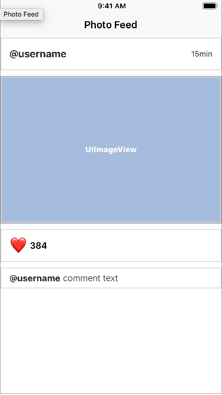
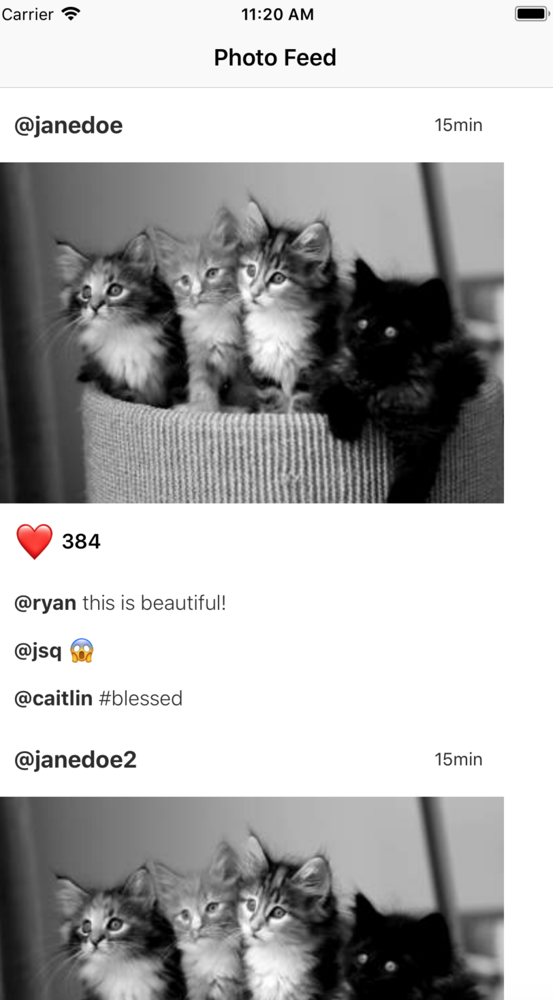

* [IGListKit](https://github.com/Instagram/IGListKit)
* [[IGListKit Tutorial](https://www.raywenderlich.com/147162/iglistkit-tutorial-better-uicollectionviews)](https://www.raywenderlich.com/147162/iglistkit-tutorial-better-uicollectionviews)

 IGListkit에 대한 가이드가 많이 있지만, 버전이 3.0으로 올라가면서 binding 부분이 강화되면서 변경된 부분들에 대한 포스트가 미흡하여 인스타그램의 예제를 보충하려 한다.


## Modeling and Binding과 필요성

 우선 [예제](https://github.com/rnystrom/IGListKit-Binding-Guide)를 fork 하고 받는다. 이 예제는 기본적인 목 데이터와 UI가 구현되어 있다. 한 게시물을 클릭했을 때 보이는 화면을 Post 데이터로 바인딩해서 표현해야 한다.



 위 View를 보면 1개의 Post 데이터를 4종류의 cell로 바인딩을 해 생성하고 각각의 cell에 필요한 데이터를 분배하는 일련의 작업을 요구한다.

 왜 1개의 Post를 4개의 cell로 나눠서 표현하는 장점은 무엇일까? 이 예제는 큰 의미가 있는데, 단순히 반복되는 comment 부분만을 tableView로 구현하는게 아닌 전체를 collectionView로 구현해서 화면을 구성하는 것 이다.

 기존의 TableView를 구성할 때에는 `CellForRows`에서 Cell의 내용을 설정해주기 때문에 미리 가변적인 셀 전체의 높이를 계산하고 그 높이만큼 `heightForRowAtIndexPath`에서 지정하는 등 자칫 복잡해질 수 있는 로직들이 존재한다.

 이렇게 구현하면 Comment가 몇개든 쉽게 구현할 수 있고 각각의 셀이 독립되어 있어 유지보수도 쉬워진다. 여기서 이미지는 1개 뿐이지만, 만약 요구사항에 다수의 이미지를 표현할 수 있도록 추가하라고 한다면, 쉽게 ImageCell을 반복해서 표현할 수 있고 무언가 새로운 요소가 추가된다 해도 새로운 셀을 하나 디자인하면 될 뿐이다.

 이렇게 각각의 아이템들을 분리하면 반복될 수 있는 부분에서 처리가 쉽고 각각의 셀이 독립되어 있어 커스텀도 쉽다. 다만, 이런 방식을 지금까지 이용하기 힘들었던 이유는 이렇게 Post의 배열해서 하나하나 4가지의 모델로 분리하고 관리하는 것이 힘들었기 때문이다.

 하지만, IGlistKit의 모델 바인딩을 통해서 쉽게 이것들을 분리하고 관리할 수 있기 때문에 여러가지 복잡한 UI 모델도 쉽게 관리할 수 있다. 현재 인스타그램처럼 게시물처럼 사진과 글이 반복되는 사내 메신저 프로젝트를 관리하고 있는 와중에 이런 방식은 필자가 가지고 있던 많은 문제들을 해결해 줄 수 있게되어 관심을 가지게 되었다.

 IGlistkit을 사용하면 또 다른 장점이 있는데, 기존의 사내 메신저의 경우 20개의 데이터를 서버에서 가져와 한꺼번에 모든 이미지를 로드해 화면에 표현하는 방식을 사용했다. 이 방식을 사용한 이유를 물어보니 스크롤 할 때 조금 더 깔끔하게 동작하기 때문이라 했는데, 이 때문에 20개씩 셀을 가져오고 화면에 보여주기까지의 로딩 시간이 길어 오히려 답답했다.

  그래서 동적으로 Rx를 공부하면서 동적으로 이미지를 로드해 로드되면 셀을 갱신하는 방법을 적용하려고 했는데, 상당히 많은 버그가 생겼다. 셀의 높이를 동적으로 높이면서 발생하는 버그와 빠르게 스크롤 하면 이미지가 로드되었는데 높이가 변하지 않았던 버그 등등 내 미숙한 개발 능력과 경험으로는 점점 복잡해지는 코드들을 관리하기 힘들었다.


 서론이 길었고 이제 IGListKit으로 위 화면을 구성하는 방법을 살펴보고 인스타 그램쪽의 개발자가 무슨 생각을 가지고 이렇게 설계하게 되었는지 알아보자.


## 1. 최상위 Post 모델 설계

4 종류의 셀을 구성할 최상위의 Post 모델은 다음과 같다.

```
final class Post: ListDiffable {
  // 1
  let username: String
  let timestamp: String
  let imageURL: URL
  let likes: Int
  let comments: [Comment]
  // 2
  init(username: String, timestamp: String, imageURL: URL, likes: Int, comments: [Comment]) {
    self.username = username
    self.timestamp = timestamp
    self.imageURL = imageURL
    self.likes = likes
    self.comments = comments
  }
}
```

 일반적인 게시물처럼 사용자 정보 1개의 이미지, 다수의 댓글(Comment)로 구성된다. 사실 이미지가 여러가일 수 있지만 여기서는 일단 1개의 이미지로 제한하고 생각해보자.

 이것만 놓고보면 일반적인 Post 모델인데 ListDiffable 프로토콜을 준수하고 있다는 점을 보자.

### IGListDiffable Protocol

ListDiffable 프로토콜이 가지고 있는 메소드는 다음과 같다.

```
func diffIdentifier() -> NSObjectProtocol {
  return as NSObjectProtocol
}
func isEqual(toDiffableObject object: ListDiffable?) -> Bool {
  return Boolean
}
```

 왜 Diffing에서 diffIdentifier와 isEqual메소드를 구현해야 할까? 이 두 메소드를 사용하는 이유는 이 두 메소드가 diffing을 수행하는 데 있어서 identity(정체성)과 equality(평등성)을 수행한다는 것이다. 일반적인 데이터베이스에서 primary key와 같이 유일한 데이터를 표현한다. equality는 두 개의 유일한 객체의 값을 비교할 때 사용됩니다.

**따라서 고유한 값을 가진(diffIdentifier가 같은) 객체를 비교해서 (isEqual) false가 나온다면 객체가 변형된 것이고 UI를 갱신할 필요가 있는 것이다.**

 또한 -isEqual 로 구현된 메소드는 2개의 객체를 비교할 때 NSDictionary와 마찬가지로 성능에 영향을 주지 않고 객체를 비교한다. 따라서 diffIdentifier와 isEqual을 구현하면 성능에 영향을 주지 않고 많은 데이터를 비교할 수 있다.

#### diffIdentifier

 diffIdentifier을 구현하는 가장 간단한 방법은 그냥 자신의 클래스를 비교하는 것이다. (self as NSObjectProtocol) 하지만 인스타그램 측에서는 Post 중에서 username과 timastamp가 일치하는 Post는 존재할 수 없기 때문에 아래와 같이 처리한다.

```
func diffIdentifier() -> NSObjectProtocol {
	return (username + timestamp) as NSObjectProtocol
}
```

#### isEqual

 자, 앞서 `diffIdentifier`를 구현했기 때문에 [ListDiffable] 속에서 이 객체가 Post라는 것을 알 수 있게 되었다. 이제 다수의 Post 속에서 2개의 Post를 어떻게 비교할 수 있을까? `isEqual`를 통해서 2개의 객체를 구분해야 한다. `isEqual`을 구현하는 적절한 방법은 무엇일까?

1. 값을 비교하기 전에 먼저 포인터를 비교해야 한다.
2. 먼저 nil 체크를 해야한다.
3. 가장 낮은 레벨의 값부터 비교해야한다. 리스트와 리스트를 비교하기 전에 int와 int를 먼저 비교하자.

권장하는 방법은 다음과 같다.

```
- (BOOL)isEqual:(id)object {
  if (self == object) {
      return YES;
  }
  if (![object isKindOfClass:[User class]]) {
      return NO;
  }
  User *right = object;
  return self.identifier == right.identifier
      && (self.name == right.name || [self.name isEqual:right.name])
      && (self.posts == right.posts || [self.posts isEqualToArray:right.posts]);
}
```

 그렇다면 Post를 비교할 때에는 어떻게 구현해야 할까? 아쉽게도 여기서는 무조건 true를 반환한다. 왜 무조건 true를 반환할까? 우리는 `diffIdentifier`에서 username과 timeStamp를 통해서 고유한 키 값을 만들었다. 만약 isEqual이 수행된다면 이미 username과 timestamp가 일치하는 값이라 볼 수 있기 때문에 무조건 같은 Post라 볼 수 있다.

```
func isEqual(toDiffableObject object: ListDiffable?) -> Bool {
  return true
}
```

 **비교연산 `isEqual`은 항상 동일안 primary key를 가진 객체 사이에서만 발생한다.**

## 2. Comment 설계

#### Comment

 이제 Post 안에 있는 Comment를 만들어보자. Comment.swift 파일을 만든다. Comment 파일을 어떻게 구성해야 할까? 생각해보자 Comment 안에는 username, username의 2개의 String이 존재한다. 이것은 간단하다.

```
class Comment:ListDiffable {
    let username:String
    let text:String
    // MARK: - init
    init(username:String,text:String) {
        self.username = username
        self.text = text
    }
}
```

 자 그럼 ListDiffable의 메소드 `diffIdentifier`  ,`isEqual`은 어떻게 구현해야 할까? Comment를 구분할 수 있게 diffIdentifier 를 구현해야 한다. 단순히 self as NSObjectProtocol을 사용해도 되지만, 인스타그램에서 권장하는 방식으로 앞의 Post에서 사용한 방식을 따르자.

```
func diffIdentifier() -> NSObjectProtocol {
	return (username + text) as NSObjectProtocol
}
```

 다음으로 `isEqual`은 어떻게 해야 할까? 이 역시 Post와 마찬가지로 username과 text는 변경되지 않는 값으로 `diffIdentifier`에서 고유값으로 사용했다. isEqual이 수행되려면 `diffIdentifier`이 일치한다는 것으로 무조건 같은 객체라 볼 수 있다.

```
func isEqual(toDiffableObject object: ListDiffable?) -> Bool {
	return true
}
```


## 3. ViewModel 설계

 Post 모델과 Comment 모델은 설계가 끝났다. 우리는 최상단의 그림에도 나와있듯 Post라는 하나의 객체를 4 종류의 view로 나누려 한다. 이 셀들은 배열처럼 순서를 가지고 표현되는데 comment의 경우 Post의 데이터를 Comment로 따로 담은 것이기 때문에 배열화 하기 쉽지만 나머지 요소들도 따로 담아야 한다. 이 아이템들을 분리하기 위해서 ViewModel을 만들 필요가 있다. 이 view model들은 `ListBindingSectionController`안에서 관리되는데 `ListBindingSectionController `자체를 작은 IGListKit이라 볼 수 있다.

 `ListBindingSectionController`에 Post 객체 하나를 넣으면 4종류의 View model로 나눠서 관리해 주기 때문에 IGListKit 안에 또 IGListKit을 구현하는 것과 같다.

```
final class UserViewModel: ListDiffable {

  let username: String
  let timestamp: String

  init(username: String, timestamp: String) {
    self.username = username
    self.timestamp = timestamp
  }

  // MARK: ListDiffable

  func diffIdentifier() -> NSObjectProtocol {
    return "user" as NSObjectProtocol
  }

  func isEqual(toDiffableObject object: ListDiffable?) -> Bool {
    guard let object = object as? UserViewModel else  { return false }
    return username == object.username
    && timestamp == object.timestamp
  }

}
```

 인스타그램에서 구현한 UserViewModel을 보자. Post에서 첫번째 셀을 구성할 username과 timestamp만으로 뷰모델을 구성했다. 이것까지는 쉽게 감을 잡을 수 있을 것이다. 우리가 눈여겨 봐야 할 것은 하단의 `ListDiffable` 구현이다.

```
 func diffIdentifier() -> NSObjectProtocol {
    return "user" as NSObjectProtocol
  }
```

 하드 코딩으로 "user"를 반환하도록 했다. 이것이 무엇을 의미하는지 알겠는가? 로직을 상상해보자. 이제 모든 `UserViewModel` 객체는 같은 primary key를 가지게 되는 것이다. 만약 data source에 `UserViewModel` 객체가 새로 추가된다면 무조건 `isEqual`이 호출되고 둘이 다르다면 기존의 `UserViewModel`객체는 data source에서 대체되는 것이다.

 **하나의 `ListBindingSectionController` 안에는 한개의 `UserViewModel`만이 존재하도록 구현한 것이다.**

 이제 `isEqual`을 잘 구현하는 것이 정말 중요해졌다. 하나라도 값이 변경된다면 cell의 UI가 갱신되는 것이다. `isEqual` 부분은 따로 살펴볼 필요 없이 그저 내부의 모든 값을 비교한다.

 이제 나머지 **image**와 **action** view model을 만들어보자.

 **ImageViewModel**은 화면에 표시할 하나의 Image url을 가지고 있다. `diffIdentifier` 역시 이 비지니스 로직에서 하나의 Post에서는 하나의 Image만을 가지고 있다고 가정하기 때문에 하드코딩으로 사용할 수 있다. `isEqual` 역시 하나의 아이템이 같은지 다른지 비교하면 간단하다.

```
class ImageViewModel: ListDiffable {
    let imageURL:String
    // MARK: - init
    init(url:String) {
        self.imageURL = url
    }
}
extension ImageViewModel {
    func diffIdentifier() -> NSObjectProtocol {
        return "image" as NSObjectProtocol
    }
    func isEqual(toDiffableObject object: ListDiffable?) -> Bool {
        guard let right = object as? ImageViewModel else {
            return false
        }
        return self.imageURL == right.imageURL
    }
}
```

 **여기서 개념을 잡고 가야 할 것은 하나의 Post에는 하나의 `ImageViewModel`만이 존재한다는 것을 명심해야 한다. 모델의 설계에 따라서 `ListDiffable`을 구현 방향을 정의할 수 있다.**

---

 다음으로 ActionViewModel을 만들어야 한다. Action cell은 이미지 하단의 좋아요 버튼이 있는 셀로 담고있어야 하는 정보로는 현재는 좋아요 숫자만을 가지고 있다.

 이 역시 Post에서 유일한 셀임으로 하드코딩으로 `diffIdentifier`를 만들고 좋아요 숫자를 `isEqual`에서 비교하면 된다.

```
final class ActionViewModel: ListDiffable {
    let likes: Int
    // MARK: - init
    init(likes: Int) {
        self.likes = likes
    }
}
// MARK: - ListDiffable
extension ActionViewModel {
    func diffIdentifier() -> NSObjectProtocol {
        return "action" as NSObjectProtocol
    }
    func isEqual(toDiffableObject object: ListDiffable?) -> Bool {
        guard let object = object as? ActionViewModel
            else {
                return false
        }
        return likes == object.likes
    }
}
```


 이제 모델과 뷰 모델이 완성되었다. 시나리오를 생각해보면 하나의 데이터를 받아서 Post를 만들었다. 이 Post 객체를 ViewModel과 Comment로 쪼개서 cell들과 바인딩 시킬 수 있게되었다.

## 4. ListBindingSectionController

 앞서 만든 모델들을 이제 실제로 쪼개고 뷰에 바인딩 시키는 작업이 필요하다. Post를 아래와 같은 4가지 데이터도 분할해야 한다.

* `UserViewModel`
* `ImageViewModel`
* `ActionViewModel`
* `Comment`

그 작업을 수행하는 SectionController를 만들고 만들어보자. 여기서 주목해야 할 것은 들어오는 데이터 형태를 Post로 제한시킬 수 있다는 점이다.

```
final class PostSectionController: ListBindingSectionController<Post>, ListBindingSectionControllerDataSource {

    override init() {
        super.init()
        dataSource = self
    }
}
```

`ListBindingSectionControllerDataSource`에서 구현해야 하는 메소드는 다음과 같다.

```
// MARK: - DataSource
extension PostSectionController {

    func sectionController(_ sectionController: ListBindingSectionController<ListDiffable>, viewModelsFor object: Any) -> [ListDiffable] {
    }

    func sectionController(_ sectionController: ListBindingSectionController<ListDiffable>, cellForViewModel viewModel: Any, at index: Int) -> UICollectionViewCell {
    }

    func sectionController(_ sectionController: ListBindingSectionController<ListDiffable>, sizeForViewModel viewModel: Any, at index: Int) -> CGSize {
    }
}
```

 메소드 이름을 보면 많이 사용하는 TableView delegate나 CollectionView의 delegate 형태와 유사해 이해하기 어렵지 않다.

 위 3가지 메소드에서 요구하는 사항은 다음과 같다.

- 최상위 모델(`Post`)에서 사전에 정의한 ViewModel들의 리스트를 반환한다. (`viewModelsFor`)
- 뷰 모델에 맞는 뷰의 사이즈를 반환한다. (`sizeForViewModel`)
- 뷰 모델에 맞는 셀을 반환한다. (`cellForViewModel`)


 가장 먼저 Post를 viewmodel의 리스트로 쪼개는 `viewModelsFor`를 구현한다.

```
func sectionController(_ sectionController: ListBindingSectionController<ListDiffable>, viewModelsFor object: Any) -> [ListDiffable] {
        guard let post = object as? Post else {fatalError()}
        let result:[ListDiffable] = [
        		UserViewModel(username: post.username, timestamp: post.timestamp),
                ImageViewModel(url: post.imageURL),
                ActionViewModel(likes: post.likes)
                ]
        return result + post.comments
    }
```

 내용을 살펴보면 object 를 Post로 컨버팅해서 ListDiffable 리스트로 만드는 단순한 과정이다.

 다음으로 셀의 사이즈를 반환한다. 이 메소드는 셀을 그리기 전에 리스트의 아이템의 숫자만큼 호출된다.

```
func sectionController(_ sectionController: ListBindingSectionController<ListDiffable>, sizeForViewModel viewModel: Any, at index: Int) -> CGSize {
        print("call sizeForViewModel")
        guard let width = collectionContext?.containerSize.width else { fatalError() }
        let height:CGFloat

        switch viewModel {
        case is ImageViewModel:
            height = 250
        case is Comment:
            height = 35
        default: // UserViewModel,ActionViewModel
            height = 55
        }

        return CGSize(width: width, height: height)
    }
```

 이 부분은 크게 고민할 부분은 없다. 넓이는 SectionController가 가지고 있는 IGListkit의 CollectionView를 통해서 넓이를 얻어오는 작업이고, 높이의 경우에는 디자인 적으로 이미 정해진 높이가 있기 때문에 상관 없다. 추후에 동적으로 Image의 높이를 변경하는 로직을 다음 포스트에서 추가할 예정이다.

 Swift에서는 Switch문을 사용해서 타입을 찾았는데  Objective-C 에서는 `isKindOfClass:`를 사용해 찾을 수 있다.

 마지막으로 cell이 화면에 보여지기 전에 cell을 만들어 주는 작업이 필요하다.

```
func sectionController(_ sectionController: ListBindingSectionController<ListDiffable>, cellForViewModel viewModel: Any, at index: Int) -> UICollectionViewCell {
        print("call cellForViewModel")

        let identifier:String
        switch viewModel {
        case is UserViewModel: identifier = "user"
        case is ImageViewModel: identifier = "image"
        case is ActionViewModel: identifier = "action"
        case is Comment: identifier = "comment"
        default:
            fatalError()
        }
        guard let cell = collectionContext?.dequeueReusableCellFromStoryboard(withIdentifier: identifier, for: self, at: index) else {
            fatalError()
        }
        return cell
    }
```

 각각의 cell에 대한 `identifier`는 `Storyboard`에 정의되어 있으니 확인해 채워 넣은 것 뿐이다.

 여기서 조금 의문점이 생길 수 있다. tableView의 delegate의 경우 셀을 만들고 그 셀을 채워주는 작업까지 필요했는데, 여기서는 그냥 셀을 만들고 반환하고 끝난다. 그럼 셀과 뷰모델을 어떻게 바인드 해야할까?


## 5. Binding Models to Cells

 `ListBindingSectionController`에서 할 작업은 끝났다. 이제 셀과 뷰 모델을 바인드해 줘야 하는데 이 동작은 자동으로 이루어 지기 때문에 우리는 신경 쓸 필요가 없다. 우리가 해 줘야 할 작업은 Cel에서 바인드 되었을 때 할 동작을 구현해 주는 것 뿐이다. 이 동작을 구현하기 위해서는 각각의 셀들이 `ListBindable` 프로토콜을 준수해야 한다.

 먼저 `ImageCell`을 열어보고 `ListBindable`을 추가해보자. `ListBindable`에서 구현해야 할 메소드는 단 하나 `bindViewModel`뿐인데, 이 메소드는 `ListBindingSectionController`에서 뷰모델이 셀과 바인드되면 호출되는 메소드다. 여기에 바인드되면 해야할 작업들을 추가해보자.

```
import UIKit
import SDWebImage
import IGListKit

final class ImageCell: UICollectionViewCell, ListBindable {

    @IBOutlet weak var imageView: UIImageView!
}
// MARK: - ListBindable
extension ImageCell {
    func bindViewModel(_ viewModel: Any) {
        guard let viewModel = viewModel as? ImageViewModel else { return }
        imageView.sd_setImage(with: viewModel.imageURL)
    }
}
```

 여기서 이미지를 로드하는데 `SDWebImage`라이브러리를 사용하는데 그건 일단 신경쓰지 말자. 이미지를 동적으로 로드하는데는 다양한 방법들이 있으니까 취향에 맞게 사용하자.

 별로 어려운 내용이 없으니 다른 cell들도 추가해 보자.

```
// UserCell.swift
extension UserCell {
    func bindViewModel(_ viewModel: Any) {
        guard let viewModel = viewModel as? UserViewModel else { fatalError() }

        self.usernameLabel.text = viewModel.username
        self.dateLabel.text = viewModel.timestamp
    }
}
// ActionCell.swift
extension ActionCell {
    func bindViewModel(_ viewModel: Any) {
        guard let viewModel = viewModel as? ActionViewModel else {
            fatalError()
        }

        self.likesLabel.text = "\(viewModel.likes)"
    }
}
// CommentCell.swift
extension CommentCell {
    func bindViewModel(_ viewModel: Any) {
        guard let viewModel = viewModel as? Comment else {
            fatalError()
        }
        self.usernameLabel.text = viewModel.username
        self.commentLabel.text = viewModel.text
    }
}
```


이제 완성되었다. 한번 화면에 찍어보자 ViewController로 가서 목 데이터를 만든다.

```
var data = [ListDiffable]()
lazy var adapter: ListAdapter = { return ListAdapter(updater: ListAdapterUpdater(), viewController: self) }()

override func viewDidLoad() {
        super.viewDidLoad()
        data.append(Post(
            username: "@janedoe",
            timestamp: "15min",
            imageURL: URL(string: "https://placekitten.com/g/375/250")!,
            likes: 384,
            comments: [
                Comment(username: "@ryan", text: "this is beautiful!"),
                Comment(username: "@jsq", text: "😱"),
                Comment(username: "@caitlin", text: "#blessed"),
                ]
        ))
        adapter.dataSource = self
        adapter.collectionView = self.collectionView
    }
```


 마지막으로 짚고 넘어가는 부분은 `ListAdapterDataSource`에서 구현해야하는 메소드다.

```
func objects(for listAdapter: ListAdapter) -> [ListDiffable] {
        return data
    }

    func listAdapter(_ listAdapter: ListAdapter, sectionControllerFor object: Any) -> ListSectionController {
        guard object is Post else { fatalError() }
        return PostSectionController()
    }

    func emptyView(for listAdapter: ListAdapter) -> UIView? { return nil }
```

 첫번째는 DataSource, 두번째는 data에 맞는 SectionViewController를 만드는 부분이다. 만약에 아이템을 여러개 넣는다면?

```
data.append(Post(
            username: "@janedoe",
            timestamp: "15min",
            imageURL: URL(string: "https://placekitten.com/g/375/250")!,
            likes: 384,
            comments: [
                Comment(username: "@ryan", text: "this is beautiful!"),
                Comment(username: "@jsq", text: "😱"),
                Comment(username: "@caitlin", text: "#blessed"),
                ]
        ))
        data.append(Post(
            username: "@janedoe1",
            timestamp: "15min",
            imageURL: URL(string: "https://placekitten.com/g/375/250")!,
            likes: 384,
            comments: [
                Comment(username: "@ryan", text: "this is beautiful!"),
                Comment(username: "@jsq", text: "😱"),
                Comment(username: "@caitlin", text: "#blessed"),
                ]
        ))
```

아이템을 하나 추가했다. 주의 할 점은 username을 바꿨다는 것이다. 우리는 앞서 Post의 `identifier`를 (username + timestamp)로 설정했기 때문에 만약 같은 이름이 들어갔다면 primarykey가 같은 아이템이 DB에 들어가는 것이다.



---

 만약 우리가 아이템을 서버에서 받아올 때 이런 오류가 생긴다면, `identifier` 설계를 잘못한게 아닌지 다시 생각해봐야한다.

다음 포스트에서는 여기서 각 셀에 대한 이벤트와 데이터가 변경되면서 발생하는 reloadData를 어떻게 처리해야 하는지 포스팅 하려 한다.
