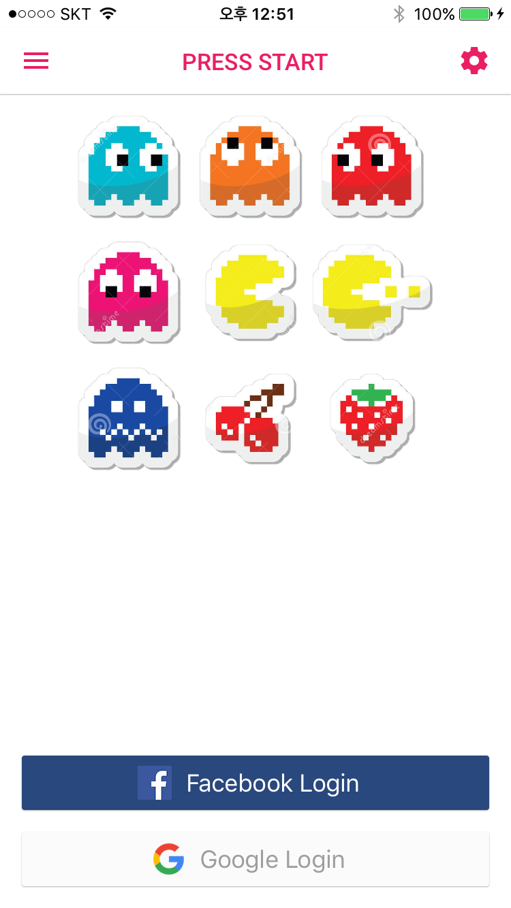

Tayga 앱 구현의 첫번째 게시물로 가장 첫 진입점인 LoginViewController의 구현부를 기록한다.

사실 이미 어느정도 개발을 진행하고 회고를 작성하고 있기 때문에 게시물의 순서는 실제 개발 순서와 조금 다를 수 있지만, 처음부터 찬찬히 적어본다.

---

### 사전 학습

1. 백앤드로 firebase를 사용했다.
   1. firebase의 프로젝트를 만들고 앱과 연동하는 부분은 [가이드](https://firebase.google.com/docs/guides/?hl=ko) 에 충분히 잘 나와있으니 이쪽을 보고 수행할 것.
2. UI로 깃 허브에 올라와있는 오픈소스 라이브러리인 [Material](https://github.com/CosmicMind/Material) 을 사용했다.
   1. 디자이너가 없는 환경에서 안드로이드의 Material 디자인은 훌륭한 가이드라인이 되어준다. iOS와 안드로이드는 UI 가이드가 완전히 다르지만, 예전에 안드로이드로 프로젝트를 진행할 때 디자인 때문에 너무 고생을 한 경험이 있기 때문에 쉽게 Material을 따르려고 한다.
   2. 위 Material라이브러리는 구글의 Materail 디자인에 맞는 수 많은 컴포넌트들을 지원하고 있어 쉽게 디자인을 구현할 수 있지만, 학습 난이도가 조금 있다.
3. 전체적인 아키텍쳐는 RxSwift를 사용하는 MVVM으로 구성하려 한다.
   1. Rx는 오래전부터 이슈가 되어왔던 개발 방법이고, 협업하는 환경에서는 쓸 수 없었지만, 이번이 좋은 기회가 될 것 같다.
   2. MVVM 패턴은 사내 기존 앱들을 보면서 끝 없는 컨트롤러를 보면서 꼭 익숙해져야 겠다고 항상 생각해왔다. 일부 유지 보수를 진행하는데 MVVM을 사용해봤지만, 프로젝트 전체에 사용하기는 이번이 처음이다. 많이 부족하지만 익숙해져야한다.


## 화면 구성



이 화면이 지금까지 구현한 로그인 화면이다. 구체적으로 뜯어볼 점은 다음과 같다.

---

* 가장 외곽으로 Material의 NavigationDrawer가 감싸고있다.
* 하단에 Google Login과 facebook login 버튼이 있다.

---

먼저 가장 외곽을 감싸고 있는 NavigationDrawer를 살펴보자.

## Navigation Drawer

 Navigation drawer는 알다싶이 안드로이드에 기본 컴보넌트로 존재하지만, iOS에는 지원하지 않는다. 하지만, 살면서 너무 익숙한 기능이라 빼고 갈 수 없었다. 그리고 먼저 만들었던 Tayga 안드로이드 버전과 동일한 UI를 구성하도록 노력했기 때문에 집에넣게 되었다.

 사용법은 매우 간단한데, Navigation Drawer의 생성자를 살펴보면

```swift
AppDelegate.swift
window = UIWindow(frame: Screen.bounds)
window!.rootViewController = NaviDrawerController(
    rootViewController: toolbar,
    leftViewController: SideMenuViewController(),
    rightViewController: SideMenuViewController()
)
window!.makeKeyAndVisible()
```

 가운데의 rootViewController와 왼쪽, 오른쪽 각각에 위치할 controller들을 만들에 붙여주면 된다. 이 때 왼쪽 오른쪽에 위치할 viewController는 일반적인 viewController를 만드는 방식으로 붙이면 되니까 특별할게 없는데, 가운데에 위치할 rootController의 경우 생각해야 할 점이 많다.

 navigation drawer에 당연히 toolbar가 존재해야 한다고 생각해서 custom toolbar Controller를 만들었다.

```swift
class NaviToolbarController: ToolbarController {
    /// 왼쪽 메뉴바 버튼
    let menuButton: IconButton = {
        let button = IconButton(image: Icon.menu,
                                tintColor: UIColorFromRGB(rgbValue: ColorPalette.mainColor.rawValue))
        return button
    }()
    /// 임시로 적용
    let rightButton: IconButton = {
        let button = IconButton(image: Icon.settings,
                                tintColor: UIColorFromRGB(rgbValue: ColorPalette.mainColor.rawValue))
        return button
    }()
    let disposeBag = DisposeBag()
    override func prepare() {
        super.prepare()
        statusBarStyle = .lightContent
        toolbar.titleLabel.textColor = UIColorFromRGB(rgbValue: ColorPalette.mainColor.rawValue)
        //toolbar setting
        toolbar.leftViews = [menuButton]
        toolbar.rightViews = [rightButton]
        // event binding
        menuButton.rx.tap.bind {
            self.navigationDrawerController?.toggleLeftView()
        }.disposed(by: disposeBag)
        rightButton.rx.tap.bind {
            self.navigationDrawerController?.toggleRightView()
        }.disposed(by: disposeBag)
    }
}
```

내용을 보면 알겠지만, 간단하게 색상을 정하고 왼쪽, 오른쪽 버튼을 붙여준게 전부다. 조금 눈여겨 봐야 할 부분이면 rx로 버튼에 이벤트를 바인딩한 부분인데, 보면 알겠지만, 간단하다.

 여기서 버튼은 IconButton이라는 Material의 icon만 있는 버튼을 사용했는데, 이 역시 일반 UIButton을 상속하고 있기 때문에 RxCocoa의 일반 사용법과 같다.

(RxCocoa는 안드로이드의 RxAndroid와 마찬가지로 사용 언어를 넘어서 OS의 컴포넌트의 속성을 Rx로 접근하여 사용 가능하게 한다.)

이는 복잡한 부분이 아니니까 간단하게 넘어가며 이 부분에 대해서는 Material의 github가 더 자세하게 나와있다.

 처음에 고생했던게 이 toolbar에 들어가는 rootViewController를 뭐로 넣어햐나나에서 고민을 많이 했다. 그냥 당연하게 toolbar와 nav drawer에 당연히 navigation controller의 기능을 포함하고 있을 것이라 생각해 처음 진입점인 LoginViewContoller를 root로 설정했었는데, 이렇게하면 navigation controller의 segue를 통한 이동을 할 수 없었다.

 그래서 그 상단에 일반적인 navigationController를 만들고 root로 그 컨트롤러를 지정해서 사용하니 segue를 통한 이동과 push, pop을 이용한 view의 스택 관리도 iOS 구현과 일치해 변수가 줄었다.

 이 라이브러리는 정말로 Material의 UI만을 제공하도록 지향하는 것 같다. 만약, 여기서 material의 다른 컴포넌트를 붙이게 된다면, root를 건드리면 된다.

 내 경우에는 Snackbar를 구현하기 위해서 navbar를 snackbar가 감싸고 그 snackbar를 toolbar가 감싸고, toolbar를 drawer가 감싸는 형태로 되어있다.

 말로만 보면 복잡해 보일 수 있으니 아래 코드를 보자.

```swift
// 네비게이션 컨트롤러를 스토리보드에서 불러온다. 이름으로 "Navigation"을 줘서 찾아오도록 했다.
// 네비게이션의 root controller가 LoginViewController
let storyBoard = UIStoryboard(name: "Main", bundle: nil)
let rootViewController = storyBoard
.instantiateViewController(withIdentifier: "Navigation")
// 스낵바를 띄워줄 스낵바 컨트롤러로 감싼다.
snackBarController = SnackbarController(rootViewController: rootViewController)
// SnackBar close button
let closeBtn = IconButton(image: Icon.close, tintColor: Color.yellow.accent4)
closeBtn.backgroundColor = Color.clear
closeBtn.addTarget(self, action: #selector(closeSnackBar), for: .touchUpInside)
snackBarController?.snackbar.rightViews = [closeBtn]
// 그 스낵바를 툴바로 감싼다.
let toolbar = NaviToolbarController(rootViewController: snackBarController!)
window = UIWindow(frame: Screen.bounds)
// 툴바를 드로워로 감싸고 그 드로워를 루트로 설정한다.
window!.rootViewController = NaviDrawerController(
rootViewController: toolbar,
leftViewController: SideMenuViewController(),
rightViewController: SideMenuViewController()
)
window!.makeKeyAndVisible()
```

  이렇게 루트 컨트롤러는 드로워로 계속 고정하고 안에 있는 네비게이션 컨트롤러에서 스택 관리를 하도록 했다. 복잡할거 같았던 수 많은 기능들을 쉽게 구현할 수 있었고, 디자인 역시 간단하게 수정 가능하게 되었다.

## Version Check (Observable  Single)

버전 체크로 firebase의 DB에서 정보를 꺼내서 비교하도록 했다. 코드를 보면 아래와 같다.

```swift
AppDelegate.swift
override func viewDidLoad() {
        super.viewDidLoad()
        ref = Database.database().reference()
        checkUpVersion()
            .subscribe(onSuccess: {
                $0 ? print("version pass") : print("version error")
            }).disposed(by: disposeBag)
}
```

firebase DB 설정은 최 상단의 가이드를 살펴보기를 바란다. 내가 이 부분에서 언급하고 싶은 부분은 Rx와 관련된 부분이다.  checkUpVersion() 메소드를 보면 아래와 같다.

```swift
AppDelegate.swift
/// Check Version on firebase DB
private func checkUpVersion() ->Single<Bool> {
    LoadingIndicator.startLoading(view: self.view)
    let deviceVersion = Bundle.main.infoDictionary?["CFBundleShortVersionString"] as? String
    return Single<Bool>.create { single in
        self.ref.child("Version").child("iOS").observeSingleEvent(of: .value) { snapshot in
        // get user value
        LoadingIndicator.stopLoading()
        let version = snapshot.value as? String
        single(.success(deviceVersion == version))
        return
        }
        return Disposables.create {}
    }
}
```

 핵심 부분을 보면 firebase DB의 ref.child("Version").child("iOS") 에 접근해서 서버에 사전에 올려둔 version을 읽어오는 부분이다.

 (내 앱의 버전을 읽는 방법은 `let deviceVersion = Bundle.main.infoDictionary?["CFBundleShortVersionString"] as? String` 를 통해서 info.plist에 접근해 버전을 가져오는 것이다.)

여기서 db에 접근하는데 `func observeSingleEvent(of eventType: DataEventType, with block: @escaping (DataSnapshot) -> Void)` 메소드를 사용하는 모습을 볼 수 있다. 원래는 여기에 클로져를 보면 알겠지만 return 값이 없기 때문에 checkUpVersion() 메소드에 클로져를 넣어서 처리했었는데, RxSwift 깃허브를 읽다보니 Single이라는 클래스가 있어서 유심히 읽어봤다.

 Single은 한번만 처리되는 이벤트를 다루기 위해서 사용되는데, 리턴으로 Success혹은 error만을 반환하고 이벤트가 넘어가면 해제되도록 디자인되어있다.

 이 Single의 가장 큰 장점은 기존에 개발하면서 이렇게 리턴이 없고 비동기 처리를 내부 클로져로만 처리하도록 구현되어있는 메소드들을 많이 만나봤고 이런 메소드들 때문에 Rx로 구현하는 이벤트 체인이 중간에 루즈해지는 경험을 많이 했었다. 하지만 이것처럼 Single을 비동기 메소드를 감싸서 Rx 형태로 만들어 사용할 수 있게 되어 흐름이 끊기지 않고 Rx 체인을 구현하게 되었고 이것을 꼭 공유하고 싶었다.

 추가적으로 하단에 `return Disposables.create {}` 안에는 dispose될 경우 처리하는 로직을 넣으면 된다. (통신 취소, loading 중단 등)


## Login Button (SnapKit)

  구글, 페이스북 로그인을 앱에 구현하는 방법은 firebase 가이드가 더 잘 설명되어 있으니 넘어가고 Button을 만들어 붙이는 과정을 공유하고 싶다.

 구글, 페이스북 로그인 프레임워에는 각자 디자인되어있는 버튼을 제공하는데, 이 버튼들은 서로 너무 다르고 커스텀해서 사용하기도 힘들다. (서로 통일시키려고 시간을 많이 잡아먹었다.) 그래서 그냥 커스텀 버튼을 만들고 이벤트를 연결하도록 했는데, 이 때 SnapKit을 사용했다.

 SnapKit은 단순히 오토 레이아웃을 쉽게 구현하도록 도와주는 라이브러리고 핵심은 코드를 통해서 뷰를 구성하는데 있다. 대부분의 나 같은 초보 개발자들은 코드로 뷰를 구성하는데 익숙하지 않다. 하지만, 많은 개발 회고들을 읽어보니 스토리보드,  xib, 코드를 적절하게 섞어서 화면을 개발하고 있었다. 말 그대로 흐름이 있으면 Storyboard를 통해서 화면을 구현하고, 스토리와 상관없이 팝업 창 등 독립된 화면을 구성하는데는 xib를 사용하는 패턴을 보여준다. 코드를 사용하여 화면을 구성하는 경우는 동적이고, lazy하게 화면을 구성할 때 사용하는데, 여기 화면을 구성할 때에는 코드로 구현할 필요는 없지만 UI를 구성하는 Materail 라이브러리가 인터페이스 빌더를 사용할 수 없어 코드로 화면을 구성했다.

 두 버튼은 아래 코드와 같다.

```swift
let googleButton: RaisedButton = {
        let button = RaisedButton(title: "Google Login", titleColor: Color.grey.base)
        button.image = #imageLiteral(resourceName: "ic_google")
        button.imageEdgeInsets = EdgeInsets(top: 0, left: 0, bottom: 0, right: 20)
        button.pulseColor = Color.orange.lighten1
        button.backgroundColor = UIColorFromRGB(rgbValue: ColorPalette.background.rawValue)
        return button
    }()
    let facebookButton: RaisedButton = {
        var button = RaisedButton(title: "Facebook Login", titleColor: UIColor.white)
        button.pulseColor = Color.amber.base
        button.image = #imageLiteral(resourceName: "ic_facebook")
        button.imageEdgeInsets = EdgeInsets(top: 0, left: 0, bottom: 0, right: 20)
        button.backgroundColor = UIColorFromRGB(rgbValue: ColorPalette.facebookDark.rawValue)
        return button
    }()
```

   이 두 버튼을 화면에 붙이고 constraints를 설정하는데 Snapkit을 썼다.

```swift
/// 화면 UI 설정
private func setUpUI() {
    self.toolbarController?.toolbar.title = "PRESS START"
    // make Google login UI
    self.view.addSubview(googleButton)
    googleButton.snp.makeConstraints { (make) in
        make.left.equalTo(self.view.snp.left).offset(16)
        make.right.equalTo(self.view.snp.right).offset(-16)
        make.bottom.equalTo(self.view.snp.bottom).offset(-16)
        make.height.equalTo(40)
    }
    self.view.addSubview(facebookButton)
    facebookButton.snp.makeConstraints { (make) in
        make.left.equalTo(googleButton.snp.left)
        make.right.equalTo(googleButton.snp.right)
        make.bottom.equalTo(googleButton.snp.top).offset(-16)
        make.height.equalTo(googleButton.snp.height)
    }
    // event binding
    googleButton.rx.tap.bind {
        self.tapGoogle()
        }.disposed(by: disposeBag)
    facebookButton.rx.tap.bind {
        self.tapFacebook()
        }.disposed(by: disposeBag)
}
```


구현 기술들은 위와 같고 별 다른 복잡한 내용은 없이 구현했다. Loading Indicator과 같은 자잘한 부분들이 틈틈히 껴있지만, 복잡한 내용은 아니니 그렇구나 하고 넘어갈 수 있는 수준이다.

앞으로 중점적으로 소개할 부분으로는 MVVM과 RxSwift를 중심으로 소개하려 한다.
