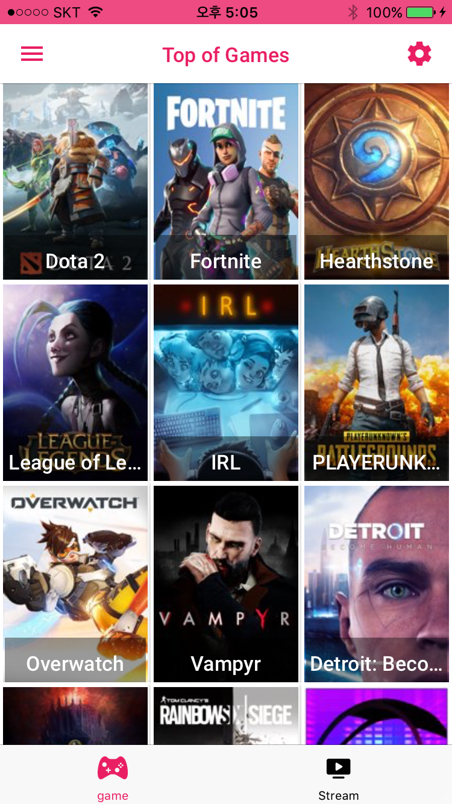

 네트워크 라이브러리의 경우, 개발 과정에서 거의 필수로 사용하고 있다. 안드로이드 개발을 진행할 땐 주로 Retrofit과 Gson을 사용해 네트워크 이벤트를 처리했었다. 사실 네트워크 라이브러리를 사용하지 않더라도 개발을 진행할 수 있지만, 많은 개발자들의 회고들을 보면, 이제는 이런 네트워크 라이브러리를 사용하지 않으면 개발을 못하겠다고 하는 사람들이 있을 정도로 폭 넓고 쉽게 네트워크 기능들을 구현할 수 있다.

 그 중 Alamofire는 Swift의 대표적인 네트워크 라이브러리다. 대부분의 앱들이 Alamofire를 사용해 개발을 진행하고, 많은 사람들이 이 Alamofire를 사용하는 포스트를 올려놓았기 때문에 사용하는데 크게 어렵지 않을 것이다. 나 역시 Alamofire의 github repo를 보면서 사용법을 많이 찾아봤었다. 그러던 중 Moya라는 프레임워크에 대해서 포스트해 놓은 글을 발견해 써봤는데, 상당히 좋은 것 같아서 오늘까지도 계속 사용하고 있다.

 이번 포스트에서는 Moya를 사용해 Twitch API를 이용하는 과정을 정리한다.


# Moya

 Moya는 우리가 Alamofire를 사용할 때 만드는 모든 네트워크 요소들을 추상화 시키는 레이어를 제공한다. Moya를 사용하면 API와 바로 연결을 할 수 있고, RxSwift나 다른 라이브러리가 제공하는 기능들을 쉽게 익스텐션으로 제공한다. Moya를 사용하면서 수행하는 기능들은 대부분 그저 Alamofire를 사용해서 구현하는 기능과 다를바 없다.

 하지만, Moya는 이 모든 엔드 포인트를 감싸는 추상화 레이어를 제공해 네트워크 사용 과정에 단일화와 명확함을 준다.


 처음에는 뭐가 좋은지 Moya를 내 앱에 추가해도 문제가 없을지 많은 고민을 했는데, 처음 Moya를 공부하게된 계기는 Moya 자체가 Alamofire를 포함하고 있기 때문에 cocoaPods에 Alamofire를 쓰던 Moya를 쓰던 줄 수 가 변함 없다는 마음에  시작했다.

단, 나는 RxSwift를 사용하기 때문에 Podfile에 아래와 같이 추가해야 한다.

```swift
pod 'Moya/RxSwift'
```

( Moya가 제공하는 RxSwift 익스텐션을 함께 불러온다. )


## Endpoint

 내가 할 동작은 TwitchAPI를 통해서 방송 중인 게임을 인기순으로 불러오는 작업이다. 이번 포스트에서는 UI 관련 작업을 진행하지 않지만 구현된 화면은 다음과 같다.



TwitchAPI.swift 파일을 만들고 다음과 같이 코딩한다.

```swift
import Moya
enum TwitchAPI {
    case getTopGame([String:String])
}
```

 Moya를 사용할 때 Endpoint 는 Enum으로 구현하도록 하고 있다. Objective -c 를 사용할 때에는 생각도 못했던 방법이다. 먼저, 타겟에 대한 enum case를 만든다. getTopGame안의 [String : String] 파라미터는 나중에 http body나 url의 파라미터 등으로 사용될 수 있다. 여기서는 가져올 수, api key 등을 전달하는데 사용한다.

 여기서 이제 여기에 Moya.TargetType을 따라야한다고 git에서는 설명하고 있다. 익스텐션으로 TargetType를 추가하면 필수로 구현해야하는 변수들이 있다.

```swift
extension TwitchAPI:TargetType {
    var baseURL: URL
    var path: String
    var method: Moya.Method
    var sampleData: Data
    var task: Task
    var headers: [String : String]?
}
```

  이 6개의 변수들이 필수로 구현해야하는 Moya의 타겟 타입들인데, 하나 하나 풀어서 뜯어보자.

1. baseURL: 통신을 위한 URL을 지정한다.

```swift
let url = "https://api.twitch.tv/kraken/"
var baseURL: URL {
        return URL(string: url)!
}
```

2. Path:  타겟에 따라 path를 지정합니다. 상단의 enum에는 stream case가 없었는데, 분기타는 과정을 보여주기 위해서 추가했습니다.

```swift
var path: String {
        switch self {
        case .stream:
            return "streams/"
        case .getTopGame:
            return "games/top"
        }
    }
```

3. method: Http 프로토콜 메소드를 정의합니다. 이번에는 get만 사용하지만 경우에 따라서 Path에서처럼 분기 처리가 가능합니다.

```swift
var method: Moya.Method {
        return .get
}
```

4. Task: 통신 Task를 어떤 것을 사용할 것인지 선택합니다. 이 때 선택하는 Task는 API의 동작 방식과 데이터에 따라서 다양한 종류가 존재합니다. (Upload, Json, data 등)

    여기서는 그저 get방식으로 뒤에 파라미터를 붙이면 되고, 이 역시 이미 준비되어있는 requestParameters를 사용해 & 형식으로 뒤에 파라미터를 붙입니다.

```swift
var task: Task {
        switch self {
        case .stream(let param):
            return .requestParameters(parameters: param, encoding: URLEncoding.default)
        case .getTopGame(let param):
            return .requestParameters(parameters: param, encoding: URLEncoding.default)
        }
    }
```

5. headers: 해더에 박을 인자 셋팅, TwitchAPI의 경우에는 해더에 제가 발급받은 키를 붙여줘야 합니다. 이 경우 다양한데, YoutubeAPI의 경우에는 파라미터랑 같이 붙여서 처리하도록 디자인되어 있습니다.

```swift
var headers: [String : String]? {
        return ["Client-ID":TwitchAPIKey]
    }
```

 이로서 enum에서 할 동작은 끝입니다. 이렇게 사전에 정의된 타겟과 endpoint를 사용하면 통일된 API를 제공할 수 있고, 이 파일 자체가 하나의 API문서의 역할을 제공하기 때문에 협업 환경에서도 네트워크 API를 한눈에 확인 가능합니다.

 다음 포스트에서는 이제 이 TwitchAPI와 Moya를 사용해 Rx를 통한 비동기 네트워크의 처리를 알아보겠습니다.
