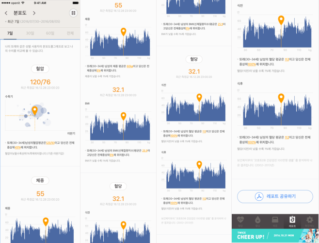
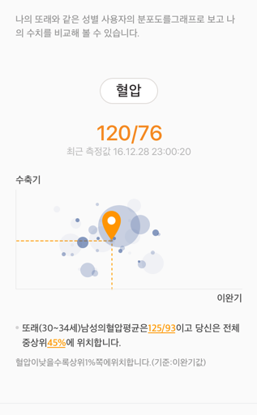
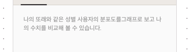

(상단의 사진은 Snapkit 라이브러리고 이번에 사용한 라이브러리는 같은 곳에서 만든 Objc 용 Masonry입니다.)


 간단하게 라벨을 코드로 만들어 붙이고 제약 조건을 걸어봅시다. 짧지만 유용하고 적용 가능한 곳이 많아 꼭 알고 넘어가도록 합시다.

# 요구사항

 자사의 혈압 다이어리 추가 개발 사항으로 아래와 같은 화면을 받았습니다.



 큰 스크롤 뷰에 횡으로 여러 스크롤뷰를 붙여넣어 안드로이드의 뷰 페이저 화면과 유사한 UI를 구성합니다. 각각의 아이템들은 값은 표시할 값이 있느냐 없느냐에 따라서 보여주는 화면이 달라지고, 값에 따라서 동적으로 그래프를 그리게 됩니다. 그래프는 Charts 라이브러리를 사용했고 이 라이브러리에 대해서는 나중에 다시 한번 다루겠습니다.

 기존에 다른 리포트 뷰 역시 이렇게 동적으로 화면을 구성하도록 되어있었는데, 혈압 다이어리의 전 담당 개발자는 xib 파일을 가지고 화면을 붙여넣어 만들었습니다. 스토리 보드를 통해서 화면을 만드는데 익숙했고, 저 역시 이 프로젝트를 받고 xib 파일을 자주 만져봐서 많이 익숙해졌습니다.

 MVVM과 RxSwift를 공부하던 중 인터넷에 공개된 많은 소스코드를 보게 되었습니다. 생각보다 엄청 많은 프로그래머들이 코드로 화면 개발하고 있었고, 많은 UI 라이브러리들이 코드로 화면을 그리는데 최적화되어 있어 한번 깊게 알아봐야겠다고 생각하고 있었습니다. 그래서 추가 개발 일정이 잡혔을 때, 디자인을 받고 이번에 코드로 화면을 구성해보자고 마음먹었습니다.

 다른 복잡한 화면도 있지만, 그렇게되면 너무 복잡해질것 같아 조금 심플한 분포도 화면을 뜯어보겠습니다.


# 화면 설계

 일단 하나의 아이템을 살펴봅시다.



 하나의 아이템은 제목, 수치, 날짜, 차트, 설명 라벨로 구성됩니다. 이 형태가 안에 내용물만 조금 바뀌면서 반복됩니다.

 모든 아이템을 다 살펴보면 너무 포스가 길어지니 이번에는 최상단의 라벨을 올리는 방법을 살펴봅시다.



 사실, 저 라벨은 그냥 라벨만 올라가있는 화면이 아닙니다. 적절한 위치와 마진을 잡기 위해서 UIView를 올려 자리를 잡고 그 안에 라벨을 올리는 방법으로 뷰를 그렸습니다. 그냥 라벨만 올려서 화면을 만들어도 되지만, 저는 안드로이드 개발할 때 부터 이런 식으로 작업하는게 익숙해져서 UIView를 위에 올렸습니다.


먼저 `UIView`와 `UILabel`을 만듭니다.

```swift
/// yPosition = 0
UIView *firstLabel = [[UIView alloc] initWithFrame:CGRectMake(0, yPosition, scrollViewWidth, 40)];
UILabel *textLabel = [[UILabel alloc] initWithFrame:CGRectMake(0, 0, scrollViewWidth, 20)];
```

 `yPosition` 은 이 뷰를 붙일 높이 위치를 잡기 위한 변수고, 최상단에 붙는 라벨이니 지금은 0입니다.


그 다음으로 라벨에 속성값을 셋팅합니다.

```swift
/// 다국어를 지원하는 앱이라 text를 동적으로 가져옵니다.
textLabel.text = [LanguageManager get:@"string_report_selfCare_intro" alter:@""];
textLabel.font = [textLabel.font fontWithSize:11.0];
textLabel.textColor = UIColorFromRGB(0x9b9b9b);
textLabel.numberOfLines = 2;
```


이제 라벨을 UIView에 올립니다.

```swift
[firstLabel addSubview:textLabel];
```


여기서 이제 제약을 추가해서 UIView에서 라벨이 차지할 위치를 정하게 됩니다.

```swift
[textLabel mas_makeConstraints:^(MASConstraintMaker *make) {
        make.left.equalTo(firstLabel.mas_left).offset(20);
        make.right.equalTo(firstLabel.mas_right).offset(20);
        make.bottom.equalTo(firstLabel.mas_bottom);
    }];
```

 원래 제약조건을 추가하려면 엄청나게 소스코드가 길어지지만, Snapkit에서 만든 objc용 라이브러리를 사용해서 짧게 제약조건을 설정합니다. 제약은 제플린(디자이너, 개발자 협업 프로그램)을 최대한 참고해서 설정합니다.


그리고 UIView를 스크롤뷰에 올립니다.

```swift
[scroll addSubview:firstLabel];
yPosition = yPosition + firstLabel.frame.size.height;
```

그리고 다음 화면을 붙이기 위해서 yPosition값을 UIView의 높이만큼 추가합니다. 이렇게하면 다음 화면을 붙일 때, UIView를 만들 위치를 정할 수 있습니다.


  아주 기초적인 코드를 사용해 UI를 구성하는 방법을 짧게 알아봤습니다. 이번 포스트는 엄청 짧지만 활용도가 높다고 생각해서 꼭 올려야겠다고 생각했습니다.

 저는 이 방법을 배우고 개발 시간이 많이 단축되었습니다. 코드로 화면을 구성하는데 익숙해지면 xib, 스토리보드와 병행해서 사용할 수 있습니다.

 저는 주로 말 그대로 스토리, 흐름이 있는 화면 구성에는 스토리보드를 쓰고, 흐름이 없는 팝업 화면 같은 경우에는 xib를 주로 쓰고 있으며 이런 동적 화면은 xib 파일과 코드를 이용해 화면을 개발하고 있습니다. 아무리 복잡하고 불규칙한 화면도 이런식으로 분할해서 구조를 잡으면 생각보다 간단한 문제일 수 있습니다.

 다음 포스트에서는 제가 이번 추가 개발에서 코드로 뷰를 구성한 활용 사례들을 뜯어보고 회고하는 포스트를 올리겠습니다.
