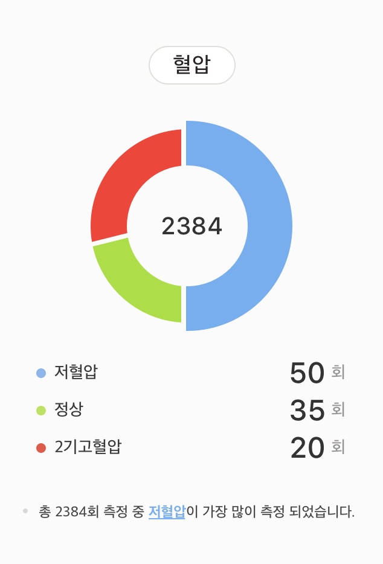
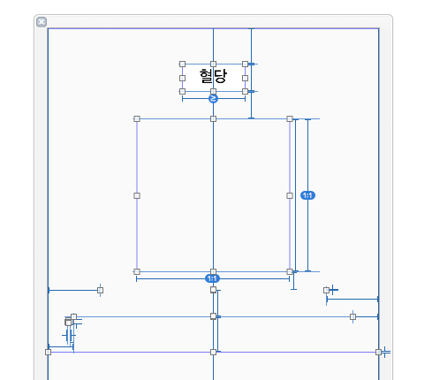
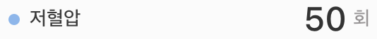

(상단의 사진은 Snapkit 라이브러리고 이번에 사용한 라이브러리는 같은 곳에서 만든 Objc 용 Masonry입니다.)

 [저번 포스트](https://leejigun.github.io/DynamicView1)에 코드를 사용해 뷰를 만들고 붙이는 작업을 살펴봤습니다.
 이번 포스트에서는 제가 이번 혈압 다이어리 추가 개발 과정에서 xib 파일과 코드를 통해 뷰를 만드는 사례들을 확인해 보겠습니다.

 # 요구사항 분석



  해당 기간동한 사용자가 수기 혹은 블루투스 측정 기기로 측정 후 입력한 값들의 패턴을 표시하는 화면입니다. 해당 기간 측정한 데이터가 없으면 데이터 입력을 요청하는 아이템을 생성하고 데이터가 있다면 화면에 보여주는 작업입니다. 지금 아이템은 혈압이지만, 체중, 혈당도 표시해야 하기 때문에 만약 모든 아이템에 대해서 데이터가 존재한다면 최대 위와 같은 아이템이 3개까지 연달아서 붙게됩니다.

 디자인적인 부분은 넘어가고, 화면을 분석해봅시다. 여기 파이 차트 아래에 있는 데이터는 보면 알겠지만, 3개만 있는게 아닙니다.  하나도 없다면, 입력을 요청하는 다른 화면이 나올테니 혈압의 경우 최소 1개에서 최대 5개의 아이템이 나올 수 있습니다. 이 화면을 단순히 xib 파일이나 스토리 보드 파일로 디자인 하려고 한다면 몹시 곤란할 것 입니다.

 상세 화면만 테이블 뷰로 만드는 방법도 시도할 수 있습니다. 테이블 뷰는 반복되는 리스트를 쉽게 그릴 수 있습니다. xib 파일로 View를 디자인해 붙이는 방법도 있습니다. 하지만, 저번 포스트에 이어서 이번에는 코드로 뷰를 만들어 붙여보겠습니다. 각각이 장단점이 있지만, 코드로 화면 그리는 방법을 익숙하게 하기 위해서 코드로 해보겠습니다.


# XIB 디자인



 코드를 통해 화면을 구성한다고 해도 모든 화면을 코드로 할 필요는 없습니다. 가장 이상적인 형태는 앞선 포스트에서도 언급했듯이 경우에 따라서 여러가지 방법들을 어우러져 사용해야 합니다. 따라서 동적으로 구현해야 하는 상세 리스트를 제외하고는 xib 파일에 디자인해봅시다.

 저번 포스트에서 라벨을 만들어 스크롤 뷰에 올릴 때 라벨 하나만을 올리지만, UIView를 만들어 그 안에 라벨을 넣고 스크롤 뷰에 올리는 방법으로 뷰를 붙여넣었습니다. 이번에도 상세 리스트 부분은 동적으로 생성하기 때문에 비어있지만, 부분도 일단 UIView로 자리를 잡아놨습니다. 그 UIView를 기준으로 제약을 걸어 이 자리가 얼마나 커지든 디자인에 맞춰 화면을 설정할 수 있게 됩니다. 지금은 이 뷰의 높이는 1입니다.

 # 상세 아이템 라벨



 하나의 아이템은 2개의 `UILabe`l과 하나의 `UIImageVIew`로 구성됩니다. 그렇다면 다루기 쉽게 이 모든 View를 감싸는 컨테이너 뷰를 만들어 봅시다.

```swift
UIView *container = [[UIView alloc] initWithFrame:CGRectMake(0, 0, width, 30)];
```


 이제 앞에 붙은 원형 색상 마크를 만들어봅시다.

```swift
UIView *image = [[UIView alloc] initWithFrame:CGRectMake(0, 0, 8, 8)];
CAShapeLayer *circleLayer = [CAShapeLayer layer];
[circleLayer setPath:[[UIBezierPath bezierPathWithOvalInRect:CGRectMake(1, 1, 7, 7)] CGPath]];
[circleLayer setStrokeColor:[color CGColor]];
[circleLayer setFillColor:[color CGColor]];
[[image layer] addSublayer:circleLayer];
```

 UIView의 레이어를 건드려 원형 서클을 그리는 동작을 합니다. [UIView의 CALayer](http://minsone.github.io/mac/ios/coreanimationlayer-and-view) 에 대한 내용은 잘 설명된 한글 블로그를 확인해 주세요. UIView는 랜더링, 레이아웃, 터치 이벤트, 에니메이션 등을 처리할 수 있습니다. 그 중에서 화면에 관한 부분을 담당하는 코어 에니메이션 클래스인 CALayer입니다. 그 안에 layer 프로퍼티가 있는데, 이 레이어도 아키텍처 트리를 가진 계층으로 관리됩니다.

 이 때 원형을 그리는데 `UIBezierPath`  를 사용해 원을 그리고 있습니다. `UIBezierPath` 를 이용해 도형을 그리는 모습은 이 [블로그](http://sapzildj.github.io/dev.client/2015/08/25/ios_make_custom_path_with_UIBezierPath)를 확인해 주세요.


 다음으로 화면에 표시할 텍스트 라벨을 만드는데, 이 때 다국어 지원을 위해 텍스트는 `LanguageManager` 를 만들어 쓰고 있습니다.

```swift
UILabel *titleView = [[UILabel alloc] initWithFrame:CGRectMake(8, 0, 100, 30)];
titleView.text = [LanguageManager get:title alter:@""];
titleView.font = [titleView.font fontWithSize:14];
```


 다음으로 수치가 표시될 라벨을 만드는데, 여기서  

```swift
UILabel *countLabel = [[UILabel alloc] initWithFrame:CGRectMake(100, 0, 100, 30)];

NSMutableAttributedString *valueString =
                    [[NSMutableAttributedString alloc]
                    initWithString:[NSString
                    stringWithFormat:@"%d",[value intValue]]
                    attributes:@{
                                NSFontAttributeName: [UIFont systemFontOfSize:25.0],
                                NSForegroundColorAttributeName: UIColorFromRGB(0x333333)
                    }];

NSAttributedString *times =
							[[NSAttributedString alloc]
                            initWithString:
                            	[LanguageManager get:@"string_report_chart_timse_unit"
                            					 alter:@""]
                            attributes:@{
                                NSFontAttributeName: [UIFont systemFontOfSize:14.0],
                                NSForegroundColorAttributeName: UIColorFromRGB(0x979495)
					}];
[valueString appendAttributedString:times];
countLabel.attributedText = valueString;
```

 만약, "50회" 라는 글자를 표시하고 싶다면, "50"이라는 글자의 속성과 "회"라는 속성을 다르게 줘야하기 때문에 글자 자체에 속성을 부여합니다.


그리고 만든 뷰들을 컨테이너 뷰에 넣고 제약을 겁니다. 이 때 앞선 포스트와 마찬가지로 프레임워크를 써서 코드 길이로 조금 줄여보겠습니다.

```swift
[container addSubview:image];
[container addSubview:titleView];
[container addSubview:countLabel];
// make LayoutConstraints using Masonary
[image mas_makeConstraints:^(MASConstraintMaker *make) {
    make.centerY.equalTo(container.mas_centerY).offset(-5.0);
    make.left.equalTo(container.mas_left).offset(8.0);
}];
[titleView mas_makeConstraints:^(MASConstraintMaker *make) {
    make.centerY.equalTo(container.mas_centerY);
    make.left.equalTo(image.mas_right).offset(16.0);
}];
[countLabel mas_makeConstraints:^(MASConstraintMaker *make) {
    make.centerY.equalTo(container.mas_centerY);
    make.right.equalTo(container.mas_right);
}];
```

 이 형태를 반복해서 리스트 형태의 상세 뷰를 구현합니다.


 그리고 반복해서 만든 뷰들을 이전에 잡아놓았던 뷰들에 차곡 차곡 넣습니다.

```swift
for(UIView *label in uiViewArray) {
    label.frame = CGRectMake(0, yPosition, width, 30);
    [_detailContainer addSubview:label];
    [label mas_makeConstraints:^(MASConstraintMaker *make) {
        make.left.equalTo(_detailContainer.mas_left);
        make.right.equalTo(_detailContainer.mas_right);
        make.top.equalTo(_detailContainer.mas_top).offset(yPosition);
        make.height.offset(30);
    }];
    yPosition = yPosition + 30;
}
```


 마지막으로 컨테이너의 높이를 알면 얼마나 높이가 증가했는지 알 수 있고, 그 높이만큼 더해 아이템의 frame을 만들면 됩니다.
