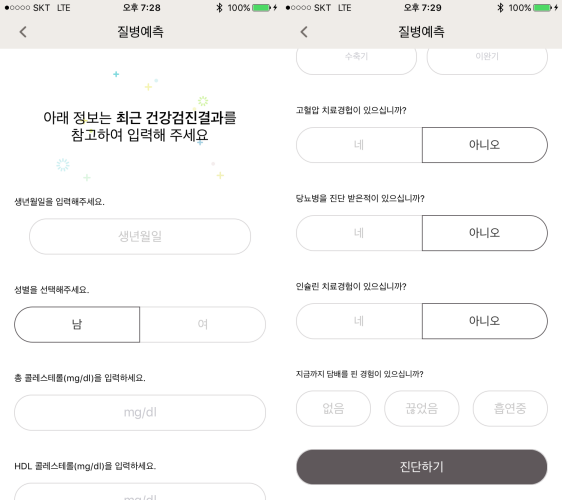

## 요구사항

 회사 내부 프로젝트인 혈압 다이어리 추가 개발 사항으로 질병 예측 분야가 추가되었습니다. 코호트 DB를 분석하여 사용자의 향후 발병 가능성을 추측해보는 솔루션입니다.

 그에 대한 개발로 사용자의 간단한 데이터를 입력받아 어떤 데이터를 내려줄 수 있는지 판단하는 설문이 들어가게 되었습니다. 이 설문은 다양한 팝업, 설정, 레포트 화면 등 다양한 진입점을 가지게 되어 스토리 보드가 아닌 Xib파일로 구성해 어디서든 띄우려고 합니다.


## 디자인된 화면



 처음 시도는 UIView를 만들어서 화면에 띄우는 방법대로 `init` 를 만들었습니다.

```swift
- (instancetype)init {
    self = [super init];
    if(self) {
        self = [[NSBundle.mainBundle loadNibNamed:@"DiseaseSurbeyViewController" owner:self options:nil] firstObject];
        self.autoresizingMask = UIViewAutoresizingFlexibleWidth;
        self.frame = frame;
    }
    return self;
}
```

 이렇게 init를 만들고 `presentViewController` 로 화면에 띄웠습니다.

```swift
DiseaseSurbeyViewController *surbeyController = [[DiseaseSurbeyViewController alloc]init];
[self presentViewController:surbeyController animated:YES completion:nil];
```

 근데, 화면에 디자인한 UI가 잘 뜨는데, IBOutlet을 하나도 인식하지 못하는 문제가 발생했습니다. 어떻게 해야할지 여러 방법을 찾아보다가 해결법을 찾아서 공유합니다.

* [링크](https://stackoverflow.com/questions/4763519/loaded-nib-but-the-view-outlet-was-not-set)

 급하신 분은 링크를 통해서 대략적인 해결 방법을 찾으실 수 있습니다.


## 솔루션

 UIView를 그리듯 bundle에서 읽어온 방법은 UIView를 읽지만 controller의 context를 참조하지 못해 IBOutlet을 참조하지 못해 발생하는 문제였습니다. 이를 해결하기 위해 다음과 같은 부분을 수정했습니다.

* `initWithNibName`
* Xib 파일 수정.

 init에서 읽어와 `loadNibNamed` 을 사용해 뷰를 읽는 것은 UIView를 읽기는 하지만 Context를 못읽는 것 같아 찾아보니 다른 소스들에서는 `initWithNibName:bundle:`  를 사용해서 controller를 읽어오는 것을 확인했습니다.

```swift
DiseaseSurbeyViewController *surbeyController = [[DiseaseSurbeyViewController alloc] initWithNibName:@"DiseaseSurbeyViewController" bundle:nil];
[self presentViewController:surbeyController animated:YES completion:nil];
```

 근데, 이걸 수정해도 nil이 나오는 것은 똑같았습니다. 그러다가 아까 언급했던 링크에서 확인해보니 **xib** 파일 자체에서 문제점을 찾을 수 있었습니다.

 저는 스토리보드에서 UIViewControoler를 만들듯이 UIViewController를 컴포넌트를 찾아서 올리고 Controller의 class에 제가 만든 커스텀 UIVIewController를 직접 기입해서 걸었습니다.


 근데, 여기 링크에서 알려주는 방법을 보니 UIView를 만들고 거기에 디자인을 넣고 Owner에 바인딩을 해줘야 했습니다. 아마 추측하기에 `initWithNibName:bundle:`  자체가 controller를 만들면서 context를 획득하고 화면에 표시할 UIView만 선택해 주는 과정만을 수행하는 것 같습니다.
